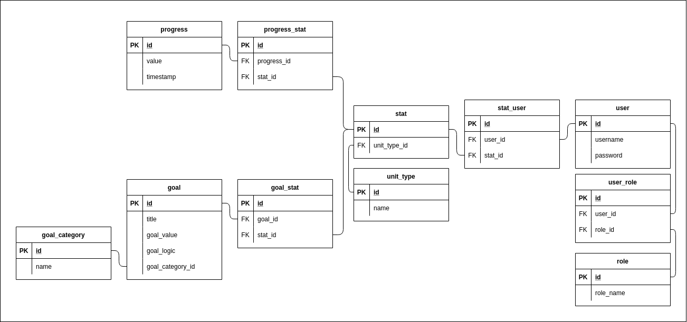
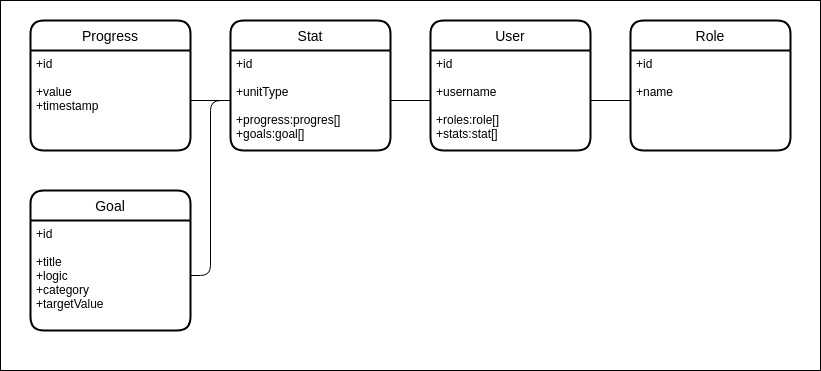

# Concept

Application is tracking a habits by measurement, that are numeric value based.\
This way there's an oportunity for making statistics on said habit progress.\
You also can set up goals on the progress.

    
Magyar

    Az alkalmazáson követni lehet a szokásainkat statisztikailag.\
    A helyett, hogy egy nap csak bejelölnénk a szokásunk teljesítését, itt követni lehet a fejlődést is.

## Features

### Multiple users \ Felhasználó kezelés

Users can register, login and delete their account.

    
Magyar

    Felhasználók tudnak regisztrálni, bejelentkezni törölni a fiókjukat.

### Creating habits with own categories and unit types \ Kategóriák és Saját mértékegységek

Sort your data in categories all your gym progresses goes in its own category.\
Select or create your own unit type to track progress like your max weight on the bench.

    
Magyar

    Az haladás kategóriákba szervezhető, így például az edzés adatok külön gyűjthetők a többi közül.\
    Míg a saját mértékegységek készítése abban segít, hogy értelmezhetően lássd eredményeid.

### Setting goals \ Célok

Creating goals for your habits, can help a lot for finding motivation to do just a bit more.\
If its a bad habit you can set up goals for doing less with customizable logic.

    
Magyar

    Ahhoz, hogy egy szokást vagy képességet elmélyits a célok elengedhetetlenek.\
    Vagy egy rossz berögződésről való leszokás is igényel egy célt.\
    Tehát létrhozhatunk célokat, akkár saját feltétel szerint is.

### External datasources \ Külső adatforrás

You can create a habbit and after that, there's option to add progress over the browser or\
by useing the service API.

    
Magyar

    Adatokat hozzáadhat a web felületen vagy egy külső alkalmazással a szolgáltatás API-ján keresztül.

### Statistics \ Statisztikák

See your progress from months to weeks and get motivated or see where you should put in more work.

    
Magyar

    Haladásunk követhetjük hónapokra és hetekre tekintve.

### You own your data \ Az adataid nálad vannak

The service can be self-hosted and easily deployed on your own computer.

    
Magyar

    A szolgáltatás saját gépen is futtatható, könnyen telepíthető.

## Plans \ Tervek

### Database \ Adatbázis

### Model \ Modell

