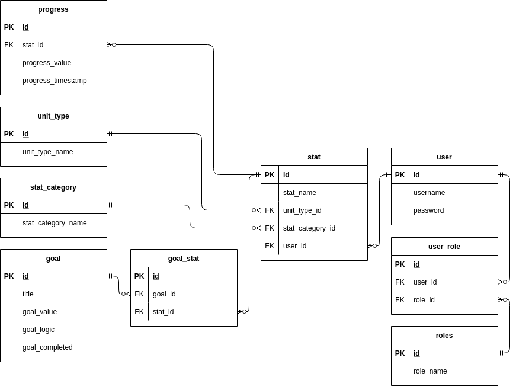
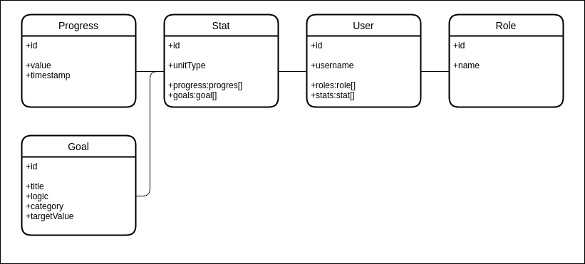

# Concept

Application is tracking a habits by measurement, that are numeric value based.\
This way there's an oportunity for making statistics on said habit progress.\
You also can set up goals on the progress.

## Features

### Stats like in a game

Create your own stat and track your progress in real life with values.

### Creating habits with own categories and unit types

Sort your data in categories all your gym progresses goes in its own category.\
Select or create your own unit type to track progress like your max weight on the bench.

### Setting goals

Creating goals for your habits, can help a lot for finding motivation to do just a bit more.\
If its a bad habit you can set up goals for doing less with customizable logic.

### Statistics

See your progress from months to weeks and get motivated or see where you should put in more work.

### User authentication (OAuth)

Users can register through they favourit provider.\
Like Google or GitHub.

### User administration

You can delete, create, edit public user information.\
This includes categories, unit types.

### You own your data

The service can be self-hosted and easily deployed on your own computer.

## Plans \ Tervek

### Database \ Adatbázis

### Model \ Modell

